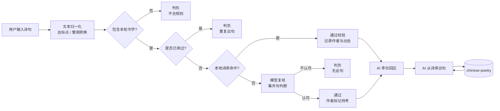

# 🍶 飞花令 · 对诗李青莲

> 和 AI 李白行一场飞花令。诗句来自本地诗库，风流交给模型，事实不靠嘴硬。


## ✨ 项目简介

这是一个网页飞花令游戏：玩家和 AI 扮演的李白围绕同一个令字轮流背诗。

项目最在意的不是“让 AI 会背诗”，而是 **不让 AI 编诗**：

- 📚 AI 出句来自本地 `chinese-poetry` 诗库，真实、可查、可追溯。
- 🧪 玩家出句先过本地规则校验：是否含令字、是否重复、诗库是否存在。
- 📝 数据库查不到的偏门句，可交给模型做“集外句”复核，并标记为“待考”。
- 🎭 大模型只负责李白口吻、点评、吐槽、认输等表达层内容。

## 🎮 玩法亮点

| 功能 | 说明 |
| --- | --- |
| 🪷 令字对战 | 随机或自选令字，双方轮流背含该字的诗句 |
| 📚 诗库兜底 | 接入 `chinese-poetry` 数据集，AI 不现场编诗 |
| 🔁 重复判定 | 同一句诗双方都不能重复使用 |
| 🎭 李白人设 | 开局、判负、认输等节点使用李白口吻回应 |
| 🏅 段位结算 | 根据玩家撑过的回合数生成段位卡 |
| 📱 移动端适配 | 手机和桌面浏览器都可以直接玩 |

## 🧭 技术架构



## 🗂️ 目录结构

```text
backend/
  main.py         FastAPI 入口
  game.py         对局规则与 AI 出句策略
  poetry_data.py  诗库加载、归一化、倒排索引
  ai.py           模型调用与李白口吻生成

frontend/
  index.html      页面结构
  style.css       古风界面与响应式样式
  app.js          前端交互与接口调用
  libai.svg       李白立绘

data/
  chinese-poetry/ 本地诗词数据集
```

## 🚀 快速开始

### 1. 📦 准备数据集

```bash
cd data
git clone --depth 1 https://github.com/chinese-poetry/chinese-poetry.git
cd ..
```

### 2. 🐍 创建虚拟环境

```bash
python -m venv .venv
```

Windows PowerShell:

```powershell
.\.venv\Scripts\Activate.ps1
```

macOS / Linux:

```bash
source .venv/bin/activate
```

### 3. 🔧 安装依赖

```bash
pip install -r backend/requirements.txt
```

### 4. 🔑 配置模型密钥

模型配置是可选的。不配置也能玩，只是李白口吻润色和集外句复核会降级。

```bash
cp .env.example .env
```

然后在 `.env` 中填写：

```env
ARK_API_KEY=你的火山方舟 API Key
ARK_MODEL=你的方舟接入点 ID
```

### 5. 🏃 启动服务

```bash
uvicorn main:app --reload --port 8000 --app-dir backend
```

打开：

```text
http://localhost:8000
```

局域网访问：

```bash
uvicorn main:app --reload --host 0.0.0.0 --port 8000 --app-dir backend
```

> ⏳ 首次启动会扫描诗库并建立“字 -> 诗句”倒排索引，数据量较大，可能需要等待数十秒。看到 `Uvicorn running on http://...` 后再打开页面。

## 📴 没有模型密钥会怎样？

核心对弈仍然可用：

- ✅ AI 出句依然来自本地诗库。
- ✅ 含令字、重复、诗库命中等规则依然本地完成。
- 💬 李白点评会使用内置模板。
- ⚠️ 数据库查不到的玩家句子无法走模型复核。

## 🧱 项目原则

> 诗句归诗库，风流归李白。

这个项目把事实判断和语言表达拆开：

- 🧾 事实层：数据库与规则系统负责。
- 🍷 表达层：模型负责李白口吻、酒桌气氛和情绪反馈。

这样既能保留 AI 的趣味，也能避免它为了押韵或气氛随口编诗。

## 🙏 致谢

- 📚 [chinese-poetry](https://github.com/chinese-poetry/chinese-poetry)：中文诗词数据集
- ⚡ [FastAPI](https://fastapi.tiangolo.com/)：后端服务框架
- 🤖 Doubao / 火山方舟：模型能力支持
